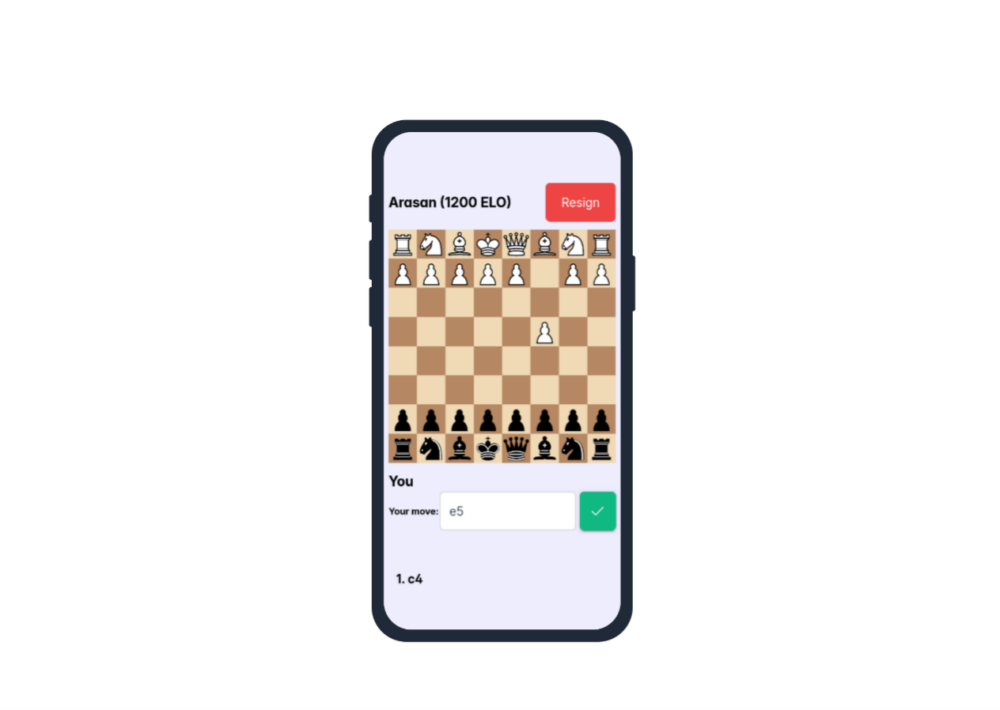

# Shakhmat

A new pedagogical way to improve chess skills.

[preview.webm](https://github.com/user-attachments/assets/5a50ab63-64f9-4f35-be49-6e7fda61cd3c)


# Table of contents

- [Why Shakhmat?](#why-shakhmat)
- [Todos](#todos "Features")
- [Getting started](#getting-started)
- [License](#license)

## Why Shakhmat?

As far as I know, a lot of chess players in my country (including me) are not really proficient at PGN notation. Even though chess plateforms like Chess.com or Lichess.org propose some ways to learn that notation, I personally found that was a bit awkward to master. That's the reason why Shakhmat was created: **why not just playing against a chess engine by using PGN notation from the very beginning until the end of a game**?

It is a didactic approach inspired by ***Blindfold chess***.

##### Chess skills enhancement

By playing regularly against chess engines by using Shakhmat, users will be proficient at PGN notation.

PGN notation mastering has some advantages:

1. They will learn openings more easily.
2. It will be straighforward for them to memorize openings sidelines and variations.
3. They will recognize and assimilate tactical patterns easier.
4. Their calculation abilities will be improved.

##### Modern and responsive user interface:



##### Friendly error handling:


##### Highly performant web application (Excellent user experience)

That web application is written in:

* Next.TS:
  - High performance, thanks to Server-Side Rendering.
* ASP.NET Core Minimal API:
  - Very high performant and low-latency data retrievals and updates.

## Todos

* [X] ~~Chess engines ELO setting~~
* [X] ~~PGN-notation-based user moves~~
* [ ] PGN moves history
* [ ] Chess engines choice
* [ ] User account registering
* [ ] User authentication and authorization
* [ ] PGN export
* [ ] Real-time games against other human players

## Getting started

##### Using Docker

###### Requirements:

- Docker

Open a new terminal and launch the following commands:

```bash
git clone https://github.com/arshavir-andreas/Shakhmat
cd Shakhmat
docker compose -f ./docker-compose.dev.yml up
```
Then, open [**http://localhost:3000**](http://localhost:3000) in your favorite browser.

## License

Shakhmat is free and distributed under the [**GNU General Public License version 3**](https://github.com/arshavir-andreas/Shakhmat/blob/main/LICENSE) (GPL v3). Essentially, this means you are free to do almost exactly what you want with the program, including distributing it among your friends, making it available for download from your website, selling it (either by itself or as part of some bigger software package), or using it as the starting point for a software project of your own.

The only real limitation is that whenever you distribute Shakhmat in some way, you MUST always include the license and the full source code (or a pointer to where the source code can be found) to generate the exact binary you are distributing. If you make any changes to the source code, these changes MUST also be made available under GPL v3.
